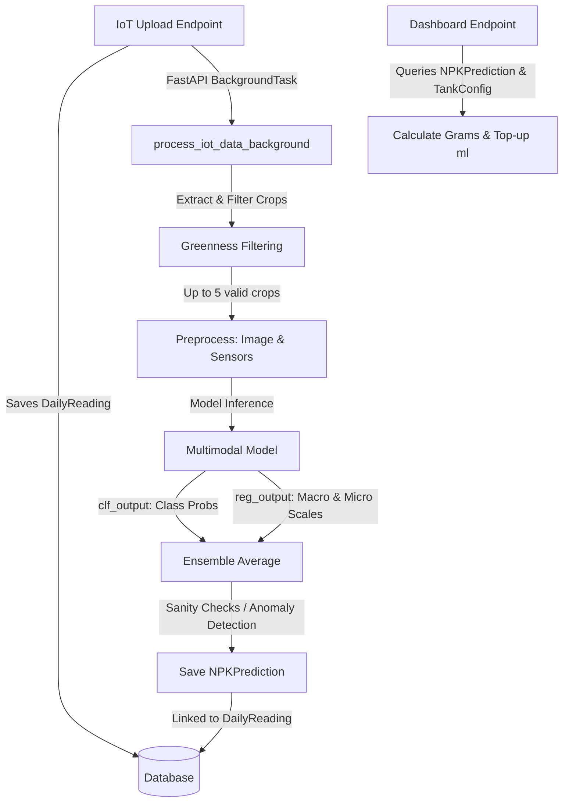

[Prev](./page-20-multi-task-ai-model.md) | [Next](./page-22-message-definitions.md)

# System Integration: **Multi-Task AI Model Execution & Dashboard**

This document describes in detail how the LeafCloud backend loads and executes the trained multi-task, multimodal Keras models (`leafcloud_multimodal_v3_*.keras`, `leafcloud_sensor_boost_*.keras`) to generate nutrient estimations and anomalies.

---

## 1. Core Architecture Overview

The system uses a **multimodal** (images + numeric sensors) and **multi-task** (classification + regression) model architecture.



---

## 2. Model Loading & Configuration

### A. Model Storage & Config
Trained model `.keras` files are placed at the root of the server directory. The server determines which model to load via the `AI_MODEL_PATH` setting.
- **Config file**: [config.py](../app/core/config.py)
- **Setting**: `settings.AI_MODEL_PATH`
- **Default value**: `"leafcloud_sensor_boost_20260516_1004.keras"` (Can be overridden via the `AI_MODEL_PATH` environment variable in `.env`).

### B. In-Memory Caching
To prevent slow disk I/O on every prediction request, the model is cached in memory.
- **Service file**: [ai_service.py](../app/services/ai_service.py)
- **Mechanism**: A global variable `_MODEL` is initialized to `None`. The `get_model()` function checks this cache and loads the model using `tf.keras.models.load_model` on the first inference task.

---

## 3. Input Preprocessing & Normalization

The model expects two distinct inputs:
1. **Image input**: shape `(batch_size, 224, 224, 3)`
2. **Sensor input**: shape `(batch_size, 3)`

### A. Crop Image Preprocessing
For each daily reading upload, the wide-angle camera image is divided into smaller crops:
1. **Extraction**: Crops are extracted from predefined grid coordinates.
2. **Greenness Filter**: Crops containing too little vegetation are discarded using `calculate_greenness(...) >= settings.GREEN_THRESHOLD` (default is `30.0`).
3. **Resizing**: The first 5 valid green crops are resized to `(224, 224)` via OpenCV:
   ```python
   resized = cv2.resize(crop_img, (224, 224))
   ```
4. **Normalization**: Colors are scaled to the standard MobileNetV2 range of `[-1.0, 1.0]`:
   ```python
   img_input = (resized.astype(np.float32) / 127.5) - 1.0
   img_input = np.expand_dims(img_input, axis=0) # shape: (1, 224, 224, 3)
   ```

### B. Sensor Telemetry Normalization
Sensor telemetry values (`ph`, `ec`, `water_temp`) are normalized to a `[0.0, 1.0]` scale using predefined min-max normalization values:
- **pH**: Normalization range `[3.0, 10.0]`
- **EC**: Normalization range `[0.0, 3.0]`
- **Water Temp**: Normalization range `[24.0, 29.0]`

The values are clamped to their ranges using `np.clip` and normalized:
```python
ph_norm = (np.clip(reading.ph, 3.0, 10.0) - 3.0) / (10.0 - 3.0)
ec_norm = (np.clip(reading.ec, 0.0, 3.0) - 0.0) / (3.0 - 0.0)
temp_norm = (np.clip(reading.water_temp, 24.0, 29.0) - 24.0) / (29.0 - 24.0)

sensor_input = np.array([[ph_norm, ec_norm, temp_norm]], dtype=np.float32) # shape: (1, 3)
```

---

## 4. Multi-Input Model Inference

For the selected daily reading, the server runs predictions on up to 5 valid leaf crops using the cached model:

```python
# Model returns [clf_output, reg_output]
clf_pred, reg_pred = model.predict([img_input, sensor_input], verbose=0)
```

### A. Ensemble Averaging
Because predictions can vary slightly across different crops of the same tank, the server aggregates the outputs:
```python
# Computes the mean along the crop axis
avg_clf = np.mean(all_clf_preds, axis=0)  # [prob_water, prob_npk, prob_micro, prob_mix]
avg_reg = np.mean(all_reg_preds, axis=0)  # [macro_scale, micro_scale]
```

---

## 5. Output Decoding & Database Persistence

### A. Classification Decode
The ensembled classification array is mapped to a predicted class:
- **Label list**: `['Water', 'NPK', 'Micro', 'Mix']`
- **Logic**: The index of the maximum probability determines the class:
  ```python
  class_idx = np.argmax(avg_clf)
  predicted_class = LABEL_LIST[class_idx]
  confidence = float(avg_clf[class_idx])
  ```

### B. Regression Scale Decode
The ensembled regression output contains two scale values:
- `macro_scale = float(avg_reg[0])`
- `micro_scale = float(avg_reg[1])`
*(A scale value of 2.0 represents 100% of the target dosage, while 0.0 represents water/empty).*

### C. Sanity Checks (Anomaly Detection)
To prevent incorrect action based on visual noise, the server cross-references classification labels against regression scales:
- **Rule 1**: If classification is `'Water'` but `macro_scale > 0.5` or `micro_scale > 0.5`, an anomaly is flagged.
- **Rule 2**: If classification is `'NPK'` (Macro) but `micro_scale > 0.5`, an anomaly is flagged.
- **Rule 3**: If classification is `'Micro'` but `macro_scale > 0.5`, an anomaly is flagged.

If any of these conditions are met, `is_anomaly` is set to `True`.

### D. Saving Predictions
The results are saved in the `npk_predictions` table linked to the parent `daily_readings.id`.
- **Database Model**: `app.models.NPKPrediction`
- **Fields**: `predicted_class`, `is_anomaly`, `macro_scale`, `micro_scale`, `confidence_score`, `prediction_date`.

---

## 6. Dashboard Calculations & Consumers

The dashboard retrieves the latest prediction record from `npk_predictions` for the requested tank and translates the continuous scale values into physical measurements:

- **Endpoint**: [iot.py](../app/api/v1/endpoints/iot.py) (`/api/v1/iot/dashboard/{tank_id}`)

### A. Physical Grams Calculation
```python
n_grams = (macro_scale * target_macro_dosage_ml_per_l * water_volume_liters) * (n_ratio / 100)
p_grams = (macro_scale * target_macro_dosage_ml_per_l * water_volume_liters) * (p_ratio / 100)
k_grams = (macro_scale * target_macro_dosage_ml_per_l * water_volume_liters) * (k_ratio / 100)
```

### B. Actionable Alerts (Top-up Math)
If either scale drops below `0.70` (70%), the server triggers a warning alert with the top-up volume required to return the tank concentration to 100% (scale `1.0` or training target equivalent):
```python
topup_macro_ml = (1.0 - macro_scale) * target_macro_dosage_ml_per_l * water_volume_liters
topup_micro_ml = (1.0 - micro_scale) * target_micro_dosage_ml_per_l * water_volume_liters
```
*(If the calculated top-up is negative or the scale is above 1.0, it defaults to `0.0`)*

### C. Anomaly Display Override
If `is_anomaly` is set to `True`, the dashboard API overrides the advisory object:
- **summary**: `"AI Sensor Anomaly Detected"`
- **explanation**: Inform the farmer that the visual analysis contradicts the sensor readings.
- **farmer_action**: `"Manual inspection and sensor recalibration required."`
- The mobile app displays a warnings banner highlighting this state.


