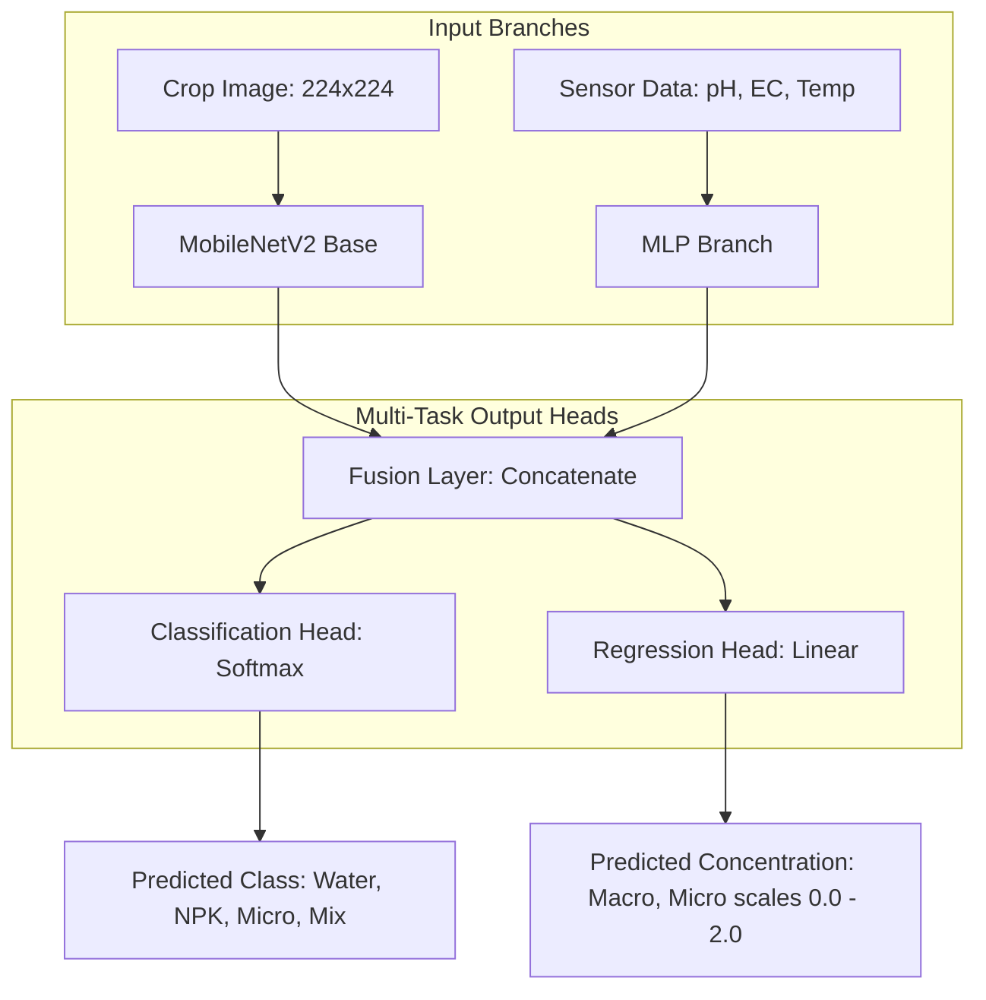

[Prev](./page-25-how-estimation-works.md) | [Next](./page-27-camera-streaming.md)

# 🧠 Nutrient Classifier v2 Training Process

A structured summary of the Multi-Task AI training workflow and configuration for `scripts/nutrient_classifier_v2.py`, based on the codebase documentation in [page-20-multi-task-ai-model.md](page-20-multi-task-ai-model.md).

---

## 🏗️ Architecture Overview

The system uses a **Sensor-Boosted Multi-Modal** architecture which handles two tasks simultaneously via **Multi-Task Learning (MTL)**:

---

## 📈 The Two-Phase Training Strategy

The training process is divided into two distinct phases to optimize performance and prevent catastrophic forgetting of base visual features.

### Phase Comparison

| Metric / Parameter | 🔄 Phase 1: Custom Head Training | 🛠️ Phase 2: Fine-Tuning |
| :--- | :--- | :--- |
| **MobileNetV2 Status** | **Frozen** (weights locked) | **Unfrozen** (Top 30 layers active) |
| **Active Training Target** | Fusion & Output Layers only | Entire network stack |
| **Learning Rate** | `5e-4` | `1e-5` (Very Low) |
| **Optimizer** | `Adam` | `Adam` |
| **Loss Weights** | Classification: `1.0`   Regression: `0.5` | Classification: `1.0`   Regression: `0.5` |

---

## 🎯 Ground Truth Data Mapping

During training, the continuous **Regression Head** is trained using the following target vector mapping based on the classification category:

> [!NOTE]
> **2.0** represents the target ideal concentration (100% dosage) defined in the experiment.

| Category Label | Classification Index | Macro (NPK) Scale Target | Micro Scale Target | Target Vector |
| :--- | :--- | :--- | :--- | :--- |
| **Water** | `0` | `0.0` | `0.0` | `[0.0, 0.0]` |
| **NPK (Macro)** | `1` | `2.0` | `0.0` | `[2.0, 0.0]` |
| **Micro** | `2` | `0.0` | `2.0` | `[0.0, 2.0]` |
| **Mix** | `3` | `2.0` | `2.0` | `[2.0, 2.0]` |

---

## 💡 Why Multi-Task (Classification + Regression) is Used

1. **Shared Learning Benefit**: By forcing the model to learn both the visual categories and numerical levels, the Classification task acts as a visual guide that makes the Regression model much more accurate.
2. **Precision Tracking**: Instead of just saying a tank has "NPK", the regression model predicts decimal values (e.g., `1.98` $\rightarrow$ `1.45` $\rightarrow$ `0.60`) showing real-time depletion as plants absorb nutrients.
3. **Safety Check (Anomaly Detection)**: If classification predicts `Water` but regression predicts high nutrients, the system flags a visual-sensor anomaly.
