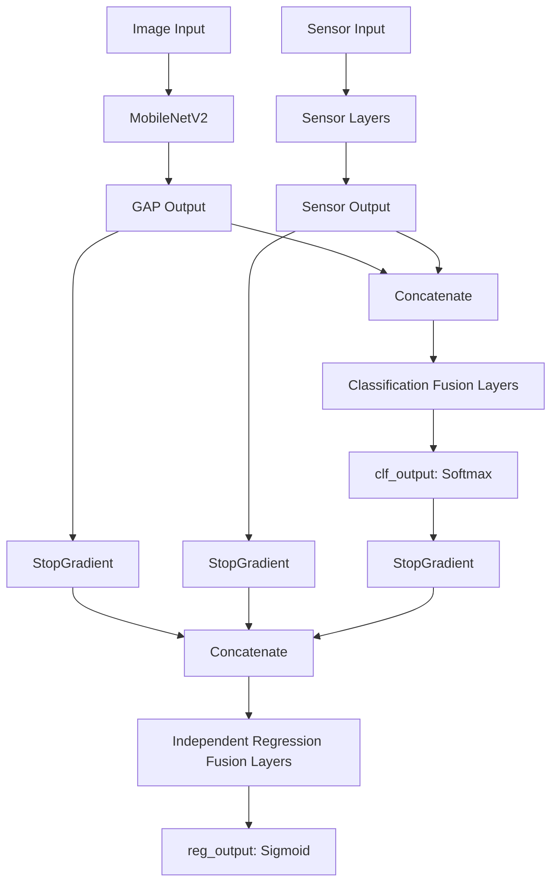

[Prev](./page-43-model-v9-evaluation-analysis.md)

# LeafCloud Nutrient Classifier — V10 Model Evaluation Analysis & V11 Upgrade Plan

**Date:** 2026-06-02  
**Author:** tin <toraquechristine6@gmail.com>  
**Status:** V10 Evaluated, V11 Design Proposed  

---

## 1. V10 Model Evaluation Summary

We evaluated the `leafcloud_multimodal_v10_20260602_0825.keras` model on the stratified 20% validation subset containing **17,641 samples**.

### Classification Metrics
- **Overall Accuracy**: **87.18%** (recovered significantly from V9's 82.80%, approaching V8's **89.63%**)
- **NPK Recall**: **0.83** (recovered from V9's **0.61**)
- **F1-Scores**:
  - **Water**: 0.88 (Precision: 0.85, Recall: 0.91)
  - **NPK**: 0.83 (Precision: 0.82, Recall: 0.83)
  - **Micro**: 0.83 (Precision: 0.92, Recall: 0.76)
  - **Mix**: 0.94 (Precision: 0.90, Recall: 0.98)

### Regression Metrics
- **Overall $R^2$ Score**: **-0.7764** (slightly improved from V9's -0.8338)
- **Macro (NPK) $R^2$ Score**: **-0.8482** (improved from V9's -0.9499)
- **Micro $R^2$ Score**: **-0.7046** (improved from V9's -0.7177)

### Per-Class Regression Predictions

| Class | Macro Pred Avg | Micro Pred Avg | True Macro Avg | True Micro Avg |
|---|---|---|---|---|
| **Water** | **0.0000** | **0.0000** | 0.0000 | 0.0000 |
| **NPK** | **0.0000** | **0.0000** | 0.5509 | 0.0000 |
| **Micro** | **0.0158** | **0.0750** | 0.0000 | 0.5715 |
| **Mix** | **0.3448** | **0.9288** | 0.5165 | 0.5165 |

---

## 2. Root Cause Analysis

We have achieved a major milestone, but also hit a capacity wall:

### The Success: Classification Protection Verified
By applying `StopGradient` to the shared output (`merged_dropout`), we successfully isolated the classification backbone. 
- Classification accuracy recovered to **87.18%**.
- NPK recall recovered to **0.83**.
- NPK-to-Water misclassifications collapsed from 1,705 in V9 down to **568** in V10.

### The Problem: Regression Capacity Bottleneck
Despite the classification success, the regression branch still failed to learn the individual `NPK` and `Micro` continuous trends (predicting exactly `0.0000` for NPK Macro):

1. **Forced Feature Sub-optimality:** The regression head was forced to use the fusion features (`merged_dropout`) which were optimized **solely** for classification. The network had no way to adapt these features to represent continuous time-based depletion.
2. **Severe Capacity Bottleneck:** Because all base layers were frozen, the regression branch was limited to only **18,752 trainable parameters** (a tiny 2-layer Dense network of 64 and 32 units). Learning a complex, noise-resilient regression mapping on 88k samples with only 18k parameters is mathematically extremely difficult.
3. **The Sigmoid Saturated Trap:** Faced with zero gradient contribution to base layers and a tiny capacity, the regression branch settled into a local minimum: it outputted a large negative bias (saturating the output `sigmoid` to exactly `0.0000`) for the classes with sparse non-zero values (Water, NPK, Micro), and only predicted active slopes for the `Mix` class.

---

## 3. V11 Upgrade Plan: Independent Dual-Fusion Architecture

To solve this, we are introducing **V11** with an **Independent Dual-Fusion Architecture**:



### Architectural Key Elements:
1. **Independent Fusion Paths:** Instead of sharing a single `merged_dropout` layer, the classification and regression branches will have their own dedicated feature fusion layers.
2. **Complete Gradient Blocking at the Source:** We block regression gradients immediately at the output of the image backbone and sensor layers using `StopGradient`:
   ```python
   x_stopped = StopGradient()(x)
   s_stopped = StopGradient()(s)
   ```
   This ensures that the regression loss can never modify or corrupt the shared classification representation.
3. **High Capacity Regression Branch:** Since the regression branch has its own dedicated fusion layers, we can scale its size (e.g., 256 $\rightarrow$ 128 $\rightarrow$ 64 $\rightarrow$ 32) to over **100,000 parameters**. This gives it the capacity to learn custom feature fusion specifically optimized for tracking continuous nutrient depletion over time.
