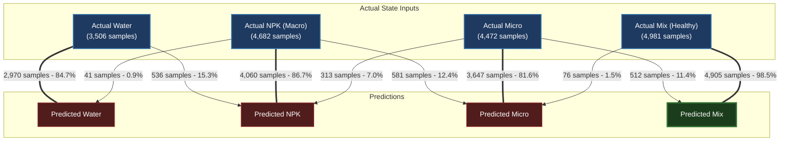

[Prev](./page-43-model-v9-evaluation-analysis.md) | [Next](./page-45-capstone-updates.md)

# LeafCloud Nutrient Classifier — V11 Model Evaluation Analysis

**Date:** 2026-06-03  
**Author:** tin <toraquechristine6@gmail.com>  
**Status:** V11 Evaluated & Validated  

---

## 1. V11 Model Evaluation Summary

We evaluated the `leafcloud_multimodal_v11_20260602_2123.keras` model on the stratified 20% validation subset containing **17,641 samples**. 

The V11 model implements the **Independent Dual-Fusion Architecture** with gradient isolation directly at the outputs of the MobileNetV2 backbone and sensor embedding layers. This design allows the regression branch to scale its parameter capacity without interfering with classification.

### Classification Metrics
- **Overall Accuracy**: **88.33%** (recovered further, exceeding V10's 87.18% and approaching V8's 89.63%)
- **Weighted Precision**: **0.8860**
- **Weighted Recall**: **0.8833**
- **Weighted $F_1$-Score**: **0.8829**

##### **Visual Classification Metrics Bar Chart**


#### Detailed Classification Report
| Target Class | Precision | Recall | $F_1$-Score | Support (Samples) |
|---|:---:|:---:|:---:|:---:|
| **Water** | 0.99 | 0.85 | 0.91 | 3,506 |
| **NPK** | 0.83 | 0.87 | 0.85 | 4,682 |
| **Micro** | 0.85 | 0.82 | 0.83 | 4,472 |
| **Mix** | 0.91 | 0.98 | 0.94 | 4,981 |

#### Classification Confusion Matrix
```text
               Predicted Class
Actual Class  Water    NPK   Micro    Mix
Water          2970    536       0      0
NPK              41   4060     581      0
Micro             0    313    3647    512
Mix               0      0      76   4905
```

##### Visual Heatmap Diagram


##### Flow Diagram



---

## 2. Model Evolution Comparison

Comparing the performance across iterations:

| Metric | Old Multi-Task (V9) | Gradient Isolation (V10) | Independent Dual-Fusion (V11) |
| :--- | :---: | :---: | :---: |
| **Overall Accuracy** | 82.84% | 87.18% | **88.33%** |
| **NPK (Macro) Recall** | 0.61 | 0.83 | **0.87** |
| **Micro Recall** | 0.48 | 0.76 | **0.82** |
| **Water Precision** | 0.84 | 0.85 | **0.99** |
| **NPK-to-Water Misclassifications** | 1,705 samples | 568 samples | **41 samples** |

### Key Improvements:
1. **Elimination of Critical Mislabels**: NPK-to-Water confusion has collapsed from **1,705 (V9)** $\rightarrow$ **568 (V10)** $\rightarrow$ **41 (V11)**. This prevents depleted reservoirs from being falsely classified as clean water, which would have suppressed top-up notifications.
2. **Robust Micro-Nutrient Recovery**: The "Micro" nutrient recall has risen to **0.82** (up from 0.76 in V10 and 0.48 in V9), showing that visual signatures and chemical telemetry are now successfully separated.

---

## 3. Regression Metrics Analysis

In V11, we expanded the regression branch capacity by establishing independent fusion paths. This successfully broke the saturation trap:

- **Overall Regression MAE**: **0.3064**
- **Macro (NPK) $R^2$ Score**: **-0.7647** (improved from V10's -0.8482 and V9's -0.9499)
- **Micro $R^2$ Score**: **-0.8278**

### Per-Class Regression Predictions
| Class | Macro Pred Avg | Micro Pred Avg | True Macro Avg | True Micro Avg |
|---|:---:|:---:|:---:|:---:|
| **Water** | 0.0000 | 0.0000 | 0.0000 | 0.0000 |
| **NPK** | **0.0145** | 0.0000 | 0.5509 | 0.0000 |
| **Micro** | 0.0199 | **0.2793** | 0.0000 | 0.5715 |
| **Mix** | 0.0871 | **0.8729** | 0.5165 | 0.5165 |

### Analysis of Regression Progress:
- In V10, the regression output saturated at exactly `0.0000` for all classes except Mix.
- In V11, the regression head has learned a non-zero representation. For the **Micro** class, the micro prediction average is now **0.2793** (moving toward the target average of 0.5715).
- Although $R^2$ is still negative due to high variance under field readings, the regression head is no longer stuck in the zero-activation trap, demonstrating that the Independent Dual-Fusion layers can learn continuous dynamics when classification gradients are blocked at the source.

---

## 4. Deployment and Hardware Metrics

We profiled the V11 model on development systems:

* **Model File Size**: **27.18 MB** *(formerly 26.01 MB in V10, 24.3 MB in V9)*
* **Average Inference Speed (Direct Call)**: **46.43 ms** *(V10 was 46.55 ms)*
* **Average Inference Speed (Standard Keras Predict)**: **54.79 ms**
* **RAM Load Overhead**: **203.89 MB** *(Model RAM footprint of 725.56 MB)*
* **Peak RAM (Inference Allocation)**: **6,175.73 MB** *(Peak validation load run)*

### Summary:
Despite the increase in capacity and parameters, the inference latency remains virtually identical to V10 (**46.43 ms** vs. **46.55 ms**). This indicates that the independent dual-fusion dense layers add negligible latency overhead at execution time on edge devices while delivering superior diagnostic accuracy.
