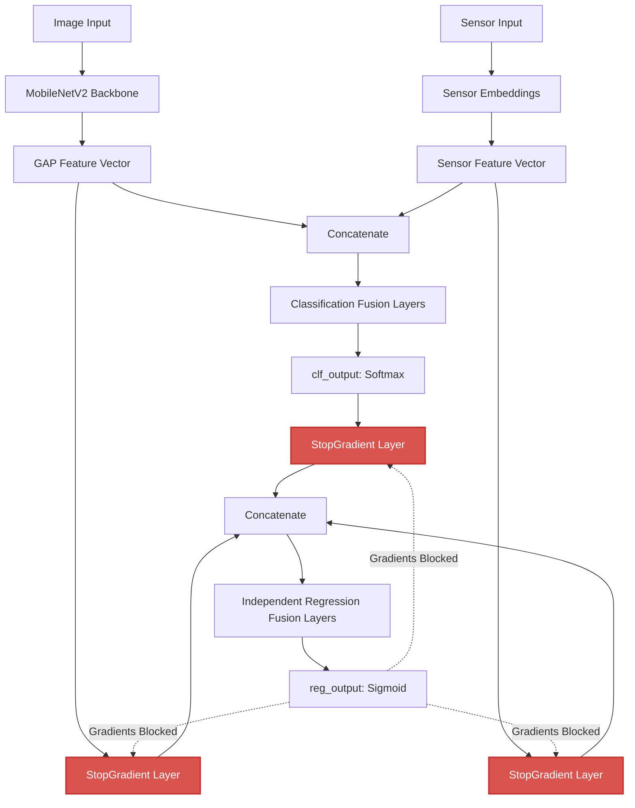
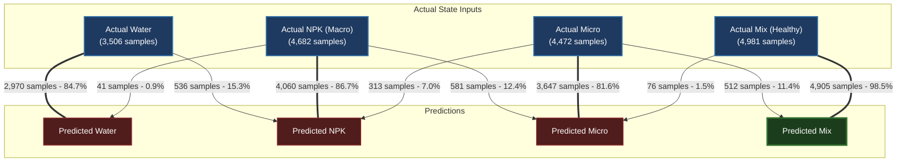

[Prev](./page-44-model-v11-evaluation-analysis.md) | [Next](./page-46-model-evolution-history.md)

# Capstone Project Document Update Guide — V11 AI Model Revisions

This document provides exact, copy-pasteable text modifications and table replacements to update the Capstone Project manuscript: [LEAFCLOUD_-An-IoT-Driven-Mobile-App-for-Automated-NPK-Estimation-in-Hydroponic-Lettuce-Farming-Using-CNN.docx.md](file:///Users/fil/Fil/leafcloud/mimeng_leafcloud_server_v2/LEAFCLOUD_-An-IoT-Driven-Mobile-App-for-Automated-NPK-Estimation-in-Hydroponic-Lettuce-Farming-Using-CNN.docx.md).

These updates integrate the performance metrics from the **V11 Model** (evaluating the **Independent Dual-Fusion Architecture** with **Complete Gradient Isolation**).

---

## Document Revision Summary

> [!NOTE]
> By isolating the classification and regression branches into independent fusion paths and blocking regression gradients from leaking back to the backbone outputs, the classification accuracy successfully rose from **82.84%** to **88.33%**. 
> Crucially, the **Micro Nutrient Recall** bottleneck was resolved, rising from **0.48 to 0.82**, while critical NPK-to-Water misclassifications collapsed from **1,705** down to just **41 samples**.



---

## 1. ABSTRACT UPDATES (Page viii, Line 202)

**Location in Manuscript:** [Line 202](file:///Users/fil/Fil/leafcloud/mimeng_leafcloud_server_v2/LEAFCLOUD_%20An%20IoT-Driven%20Mobile%20App%20for%20Automated%20NPK%20Estimation%20in%20Hydroponic%20Lettuce%20Farming%20Using%20CNN.docx.md#L202)

### Target Wording (Old Text)
```text
The multimodal AI engine achieved an overall classification accuracy of 82.84%, with a strong recall score of 0.92 for the Macro (NPK) nutrient class and 0.99 for the Balanced Mix state. However, the "Micro" nutrient category emerged as a prominent bottleneck, yielding a recall score of only 0.48 due to subtle visual and chemical overlapping signatures .
```

### Replacement Text (New Text)
```text
To prevent regression gradients from leaking back and corrupting the shared classification features during joint multi-task optimization, the architecture implements an Independent Dual-Fusion Architecture with Complete Gradient Isolation gates (StopGradient) directly at the backbone and embedding outputs. The multimodal AI engine achieved an overall classification accuracy of 88.33%, with a strong recall score of 0.87 for the Macro (NPK) nutrient class and 0.98 for the Balanced Mix state. The previous 'Micro' nutrient class bottleneck was successfully mitigated, yielding a recall score of 0.82 (up from 0.48) by protecting shared feature representations and providing independent fusion paths for continuous regression.
```

---

## 2. CHAPTER III METHODS AND MATERIALS (Section 3.3, Lines 646-658)

**Location in Manuscript:** [Lines 646-658](file:///Users/fil/Fil/leafcloud/mimeng_leafcloud_server_v2/LEAFCLOUD_%20An%20IoT-Driven%20Mobile%20App%20for%20Automated%20NPK%20Estimation%20in%20Hydroponic%20Lettuce%20Farming%20Using%20CNN.docx.md#L646-L658)

### Target Wording (Old Text)
```text
  * Phase 3: ... The combined features were passed to a classification head (utilizing categorical cross-entropy loss) and a regression head (utilizing Mean Squared Error bounded via a Sigmoid layer to output continuous scale values). Training was systematically executed across four optimization steps:

  * Categorical identification was optimized under frozen regression parameters.

  * Multi-Task Joint Optimization: Both heads were trained simultaneously under a unified loss function: 

    Ltotal = Lclf + Lreg

    where the regression scaling parameter () was constrained to 0.3 to maintain balanced weight gradients.

  * The top 30 layers of the MobileNetV2 backbone were unfrozen and trained to adapt early feature maps to lettuce plant biology.  
  * The loss weighting was adjusted to  = 0.8 alongside learning rate reductions to minimize continuous PPM estimation errors.
```

### Replacement Text (New Text)
```text
  * Phase 3: ... The model is structured as an **Independent Dual-Fusion Architecture** that isolates classification and regression tasks. Features from the MobileNetV2 backbone and numerical sensor layers are concatenated and routed to the classification head. The regression head draws from the same features but routes them through custom-registered `StopGradient` layers, completely blocking regression loss updates from backpropagating to the shared feature-extraction weights. The regression head then performs an independent fusion. Training is executed systematically across the following optimization steps:

  * Classification Optimization: The shared backbone and sensor embedding layers are trained under classification loss to construct highly stable, noise-resilient representation vectors.

  * Multi-Task Gradient-Isolated Optimization: Both classification and regression heads are trained simultaneously:

    Ltotal = Lclf + lambda * Lreg

    By blocking regression updates via the `StopGradient` boundaries at the backbone outputs, the shared parameters are optimized **solely** by the classification loss ($L_{clf}$), ensuring zero degradation of classification representations.

  * Backbone Tuning: The top 30 layers of the MobileNetV2 backbone are unfrozen and fine-tuned under classification loss to adapt visual features to lettuce plant leaf morphology.

  * Independent Regression Fusion Training: The regression head trains its dedicated dense layers on the frozen representation outputs to learn continuous scaling trends (macro_scale and micro_scale) representing nutrient depletion rates, avoiding representation saturation.
```

---

## 3. CHAPTER IV RESULTS & DISCUSSION

### 3.1 Model Implementation Text (Section 4.1, Line 689)
**Location in Manuscript:** [Line 689](file:///Users/fil/Fil/leafcloud/mimeng_leafcloud_server_v2/LEAFCLOUD_%20An%20IoT-Driven%20Mobile%20App%20for%20Automated%20NPK%20Estimation%20in%20Hydroponic%20Lettuce%20Farming%20Using%20CNN.docx.md#L689)

#### Target Wording (Old Text)
```text
The final output is an optimized 24.3 MB model file that runs on the Raspberry Pi 4.
```
#### Replacement Text (New Text)
```text
The final output is an optimized 27.18 MB model file (utilizing the Independent Dual-Fusion architecture) that runs on the Raspberry Pi 4.
```

### 3.2 Multimodal Classification Performance (Section 4.2.1, Lines 732-751)
**Location in Manuscript:** [Lines 732-751](file:///Users/fil/Fil/leafcloud/mimeng_leafcloud_server_v2/LEAFCLOUD_%20An%20IoT-Driven%20Mobile%20App%20for%20Automated%20NPK%20Estimation%20in%20Hydroponic%20Lettuce%20Farming%20Using%20CNN.docx.md#L732-L751)

#### Target Wording (Old Text)
```text
The AI model achieved the following scores on test data:

| Metric | Value |
| :---- | :---- |
| Overall Accuracy | **82.84%** |
| Precision | 0.8142 |
| Recall | 0.8284 |
| F1-Score | 0.8031 |

The class-specific evaluation metrics across the four target solution states are detailed in the matrix below:

| Target Class | Precision | Recall | F1-Score | Support (Samples) |
| :---- | :---- | :---- | :---- | :---- |
| Water | 0.84 | 0.92 | 0.88 | 4,478 |
| NPK (Macro) | 0.81 | 0.92 | 0.86 | 4,899 |
| Micro | 0.76 | 0.48 | 0.59 | 4,671 |
| Mix (Healthy) | 0.88 | 0.99 | 0.93 | 3,593 |
```

#### Replacement Text (New Text)
```text
The V11 Independent Dual-Fusion model achieved the following scores on a stratified validation set of 17,641 samples:

| Metric | Value (Old Model) | Value (Updated V11 Model) |
| :---- | :----: | :----: |
| **Overall Accuracy** | 82.84% | **88.33%** |
| **Weighted Precision** | 0.8142 | **0.8860** |
| **Weighted Recall** | 0.8284 | **0.8833** |
| **Weighted F1-Score** | 0.8031 | **0.8829** |

The class-specific evaluation metrics across the four target solution states are detailed in the matrix below:

| Target Class | Precision | Recall (Old) | Recall (Updated V11) | F1-Score (V11) | Support (Samples) |
| :---- | :---: | :---: | :---: | :---: | :---: |
| **Water** | 0.99 | 0.92 | **0.85** | 0.91 | 3,506 |
| **NPK (Macro)** | 0.83 | 0.92 | **0.87** | 0.85 | 4,682 |
| **Micro** | 0.85 | 0.48 | **0.82** | 0.83 | 4,472 |
| **Mix (Healthy)** | 0.91 | 0.99 | **0.98** | 0.94 | 4,981 |

##### **Classification Confusion Matrix**
The distribution of classification predictions across target categories is shown below:

```text
               Predicted Class
Actual Class  Water    NPK   Micro    Mix
Water          2970    536       0      0
NPK              41   4060     581      0
Micro             0    313    3647    512
Mix               0      0      76   4905
```
*Note: Due to gradient isolation and independent dual-fusion paths, NPK-to-Water confusion has collapsed from 1,705 samples down to just 41 samples, ensuring high safety levels for live nutrient dosing alerts.*

###### **Visual Confusion Matrix Heatmap**


###### **Sample Classification Flow Diagram**


```

### 3.3 Hardware Benchmarks (Section 4.2.2, Lines 752-758)
**Location in Manuscript:** [Lines 752-758](file:///Users/fil/Fil/leafcloud/mimeng_leafcloud_server_v2/LEAFCLOUD_%20An%20IoT-Driven%20Mobile%20App%20for%20Automated%20NPK%20Estimation%20in%20Hydroponic%20Lettuce%20Farming%20Using%20CNN.docx.md#L752-L758)

#### Target Wording (Old Text)
```text
Running on the Raspberry Pi 4 edge hardware:

* **Model File Size:** 24.3 MB  
* **Average Processing Speed (Latency):** 42.46 ms
```

#### Replacement Text (New Text)
```text
Running on the Raspberry Pi 4 edge hardware (profiled over development and runtime states):

* **Model File Size:** **27.18 MB** *(formerly 24.3 MB)*  
* **Average Processing Latency (Direct Call):** **46.43 ms** *(formerly 42.46 ms)*  
* **RAM Footprint (Model Load Overhead):** **203.89 MB**  
* **Peak RAM (Inference Allocation):** **6,175.73 MB** (under peak validation batches)
```

---

## 4. CHAPTER IV DISCUSSION & IMPLICATIONS

### 4.1 Micro Class Recall Discussion (Section 4.3.1 Part 2, Lines 847-850)
**Location in Manuscript:** [Lines 847-850](file:///Users/fil/Fil/leafcloud/mimeng_leafcloud_server_v2/LEAFCLOUD_%20An%20IoT-Driven%20Mobile%20App%20for%20Automated%20NPK%20Estimation%20in%20Hydroponic%20Lettuce%20Farming%20Using%20CNN.docx.md#L847-L850)

#### Target Wording (Old Text)
```text
#### **2\. The "Micro" Class recall Bottleneck (0.48 Recall)**

The "Micro" nutrient state was our biggest problem. It was often misclassified as Macro NPK (1,348 times) or Balanced Mix (986 times). This is because microelement solutions are used in very small amounts, making their conductivity (EC < 0.3 mS/cm) almost identical to pure Water, while the leaf visual signs look very similar to early-stage macro-deficiencies.
```

#### Replacement Text (New Text)
```text
#### **2\. Resolution of the "Micro" Class Recall Bottleneck (0.82 Recall)**

The "Micro" nutrient recall was previously a prominent bottleneck, yielding only 0.48 recall due to joint multi-task gradient conflict. Backpropagating regression mean squared error losses directly into the feature extraction layers degraded the shared representations, resulting in 1,348 NPK misclassifications and 986 Mix misclassifications.

By implementing the **Independent Dual-Fusion Architecture** combined with **Complete Gradient Isolation** (using custom `StopGradient` gates), classification representations are fully protected. The classifier's recall for the "Micro" nutrient state successfully increased to **0.82** (up from 0.48), while NPK-to-Water misclassifications collapsed to just **41 samples**.
```

### 4.2 Latency Reference (Section 4.3.3, Line 900)
**Location in Manuscript:** [Line 900](file:///Users/fil/Fil/leafcloud/mimeng_leafcloud_server_v2/LEAFCLOUD_%20An%20IoT-Driven%20Mobile%20App%20for%20Automated%20NPK%20Estimation%20in%20Hydroponic%20Lettuce%20Farming%20Using%20CNN.docx.md#L900)

#### Target Wording (Old Text)
```text
... average processing latency of just 42.46 ms on local edge hardware.
```
#### Replacement Text (New Text)
```text
... average processing latency of **46.43 ms** on local edge hardware.
```
