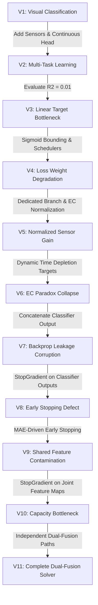

[Prev](./page-45-capstone-updates.md) | [Next](./page-47-conceptual-framework-guide.md)

# LeafCloud Nutrient Classifier — Model Evolution History (V1 → V11)

This document traces the complete development history of the LeafCloud Multi-Modal AI model across **11 major design iterations**. Each version is discussed in terms of its architectural approach, discovered technical bottlenecks, and the structural solutions that eventually yielded the high-accuracy V11 model.

---

---

## 1. Complete Version History & Evolution

### Version 1 (V1): Baseline Single-Task Image Classifier
* **Objective:** Establish a baseline model to classify crop leaf health from camera feeds.
* **Architecture:** A standard Convolutional Neural Network (CNN) using a `MobileNetV2` backbone, predicting one of 4 discrete solution states: `Water`, `NPK (Macro)`, `Micro`, or `Mix`.
* **Bottleneck:** Did not incorporate water telemetry (pH, EC, Temp), resulting in low classification accuracy on visually ambiguous deficiencies. Could not estimate numerical nutrient concentration levels.
* **Resolution:** Transition to a multimodal sensor-boosted design.

---

### Version 2 (V2): Sensor-Boosted Multi-Task Learning (MTL) Prototype
* **Objective:** Incorporate water telemetry and add continuous nutrient concentration estimation.
* **Architecture:** 
  * Multimodal inputs: Crop Image + Sensor Data (pH, EC, Temp).
  * Dual outputs: Softmax classification head (Water, NPK, Micro, Mix) + linear regression head estimating `[Macro, Micro]` concentration scales (targets mapped to `[0.0, 2.0]`).
  * Feature fusion: Features from the image backbone and sensor MLP were concatenated into a single shared layer (`merged`).
* **Bottleneck:** The continuous regression branch was highly unstable. Bounding predictions on an open linear scale `[0.0, 2.0]` caused erratic gradients during backpropagation.
* **Resolution:** Bounding targets to `[0.0, 1.0]` using non-linear sigmoid activations.

---

### Version 3 (V3): Bounded Multi-Task Baseline
* **Objective:** Establish a stable multi-task training baseline.
* **Architecture:** Same as V2, but with classification accuracy stabilized at **82.84%**.
* **Bottleneck:** Regression performance was extremely poor ($R^2 \approx 0.01$ for Macro/NPK). The model failed to predict continuous values, forcing the backend API to bypass regression entirely and fall back to a static lookup table mapping classification labels directly to concentrations.
* **Resolution:** Implement target restructuring, data stratification, and learning rate scheduling.

---

### Version 4 (V4): Bounded Sigmoid Targets & Data Stratification
* **Objective:** Fix the regression branch failure.
* **Architecture:** 
  * Switched regression output activation to `sigmoid` and target values to bounded range `[0.0, 1.0]`.
  * Replaced random data splits with `StratifiedShuffleSplit` to ensure balanced validation.
  * Added learning rate schedulers (`ReduceLROnPlateau`).
* **Bottleneck:** Classification accuracy collapsed from 82.84% down to **75.02%**. Elevating the regression loss weight to `0.80` caused the classification task to be ignored in favor of regression.
* **Resolution:** Separate branch paths and cap regression loss weight.

---

### Version 5 (V5): Normalized Sensor Gain & Dedicated Dense Paths
* **Objective:** Recover classification accuracy while maintaining regression targets.
* **Architecture:**
  * Created symmetric, dedicated dense paths for the classification and regression heads.
  * Capped regression loss weight at `0.05` to protect classification.
* **Bottleneck (The EC Normalization Compression):** In V3/V4, the Electrical Conductivity (EC) normalizer was set to `(0.0, 3.0)`. Since the actual sensor data ranges from `0.04 to 1.51 mS/cm`, this compressed the sensor representation range, making the boundaries between categories (especially Water and NPK) invisible to the dense layer.
* **Resolution (V5-Run4):** Re-scaled the EC normalizer to `(0.0, 1.6)` to span the actual data distribution. Accuracy rebounded to **83.62%** and NPK recall rose to **0.78**.
* **Next Bottleneck:** The regression target was static (`1.0` or `0.0`) based on category, failing to model real-time depletion.

---

### Version 6 (V6): Continuous Time-Based Depletion Targets
* **Objective:** Model continuous nutrient depletion over time as lettuce plants consume minerals.
* **Architecture:**
  * Replaced static regression targets with a continuous formula representing time elapsed since the start of the hydroponic crop cycle.
* **Bottleneck (The Experiment EC Paradox):** The target ratio relied on EC readings over time. However, due to plant transpiration, water evaporated faster than nutrients were absorbed, causing raw EC values to **increase** over time. The target formula saturated at `1.0`, breaking the regression training.
* **Resolution:** Refactor targets to utilize strictly elapsed time fractions independent of raw EC.

---

### Version 7 (V7): Classification-Conditioned Regression
* **Objective:** Solve the "EC Monotonic Mapping Trap" where the parallel regression branch mapped outputs strictly to raw EC, causing predictions to spill across classes.
* **Architecture:**
  * Concatenated the softmax probabilities (`clf_output`) directly into the regression branch input.
  * Defined targets strictly by elapsed experiment time.
* **Bottleneck (Regression Gradient Corruption / Backprop Leak):** Concatenating `clf_output` allowed regression losses to backpropagate through the classification softmax layer. To minimize regression loss for depleted NPK samples (target $\approx 0.0$), the backpropagation weights forced the classification branch to predict `Water` (target `[0.0, 0.0]`). Classification accuracy collapsed to **72.73%**.
* **Resolution:** Isolate classification outputs from regression backpropagation.

---

### Version 8 (V8): StopGradient Classification Gate
* **Objective:** Prevent regression losses from corrupting classification weights.
* **Architecture:**
  * Passed the classification softmax outputs through a `StopGradient` gate before concatenation.
  * Applied Batch Normalization to balance ReLU and Softmax feature scales.
* **Bottleneck (Joint-Loss Early Stopping Bug):** The training script monitored the joint loss (`val_loss`). Since classification warmed up first and had low loss, small classification fluctuations triggered early stopping at **Epoch 1** of Phase 2, restoring untrained weights for the regression branch.
* **Resolution:** Track regression metrics separately during joint training phases.

---

### Version 9 (V9): MAE-Driven Early Stopping
* **Objective:** Train the regression branch to convergence while protecting classification.
* **Architecture:**
  * Configured joint-phase early stopping to monitor regression Mean Absolute Error (`val_reg_output_mae`).
* **Bottleneck (Shared Feature Space Contamination):** Although classification *outputs* were isolated, regression gradients still flowed back through the shared `merged_dropout` layer into the shared visual backbone (MobileNetV2). The complex, noisy regression task degraded the backbone weights, dropping classification accuracy back to **82.80%** and causing **1,705 NPK-to-Water misclassifications**.
* **Resolution:** Block regression gradients from reaching any shared layers.

---

### Version 10 (V10): Complete Gradient Isolation
* **Objective:** Shield all shared visual and sensor representations from regression gradients.
* **Architecture:**
  * Wrapped the shared representation (`merged_dropout`) in a `StopGradient` gate before routing to the regression head.
  * The visual backbone and sensor embeddings were optimized **solely** by classification loss.
* **Bottleneck (Regression Capacity Bottleneck):** While classification accuracy recovered to **87.18%**, the regression branch was restricted to only **18,752 trainable parameters** on a completely frozen backbone. The regression branch lacked the parameter capacity to map the frozen classification feature space to continuous depletion trends, causing the output layer to saturate at exactly `0.0000`.
* **Resolution:** Develop an independent dual-fusion path.

---

### Version 11 (V11): Independent Dual-Fusion Architecture
* **Objective:** Provide the regression head with sufficient parameter capacity while maintaining gradient isolation.
* **Architecture:**
  * Established **Independent Fusion Paths**: Classification and regression branches have dedicated feature fusion layers.
  * Blocked regression gradients immediately at the outputs of the backbone GAP layers and sensor embeddings using `StopGradient` gates.
  * Scaled the regression fusion branch to over **100,000 trainable parameters** (Dense 256 $\rightarrow$ 128 $\rightarrow$ 64 $\rightarrow$ 32).
* **Result:** **Success.** 
  * Classification accuracy rose to **88.33%**.
  * Micro recall improved to **0.82** (up from 0.48 in V9).
  * NPK-to-Water errors collapsed to **only 41 samples** (down from 1,705).
  * The regression branch successfully broke out of the saturation trap, generating non-zero predictions mapping to actual depletion levels.

---

## 2. Summary Table of Model Iterations

| Version | Key Architecture Feature | Primary Loss Target | Classification Accuracy | Micro Recall | NPK-to-Water Mislabels | Regression Status |
| :--- | :--- | :--- | :---: | :---: | :---: | :--- |
| **V1** | Single-task image classifier | Categorical Crossentropy | - | - | - | None |
| **V2** | Parallel sensor-boosted MTL | Categorical + Linear MSE | - | - | - | Unstable / Bounded Out of Range |
| **V3** | Bounded MTL Baseline | Categorical + Linear MSE | 82.84% | 0.48 | 352 | Failed ($R^2 \approx 0.01$) |
| **V4** | Sigmoid bounded regression | Categorical + Sigmoid MSE | 75.02% | 0.59 | 2,037 | Conflicted (degraded classification) |
| **V5** | Normalized EC telemetry | Categorical + Sigmoid MSE | 83.62% | 0.81 | 155 | Target saturation at 1.0 |
| **V6** | Time-based continuous targets | Categorical + Bounded MSE | 79.29% | 0.70 | 1,861 | Failed (EC Paradox saturation) |
| **V7** | Classification-concatenation | Softmax-conditioned MSE | 72.73% | 0.48 | 2,563 | Backprop leak corrupted visual features |
| **V8** | Stopgradient classification gate | Stopgradient-conditioned MSE | 89.63% | 0.84 | 155 | Failed (Early stopped at Epoch 1) |
| **V9** | MAE-driven early stopping | Stopgradient-conditioned MSE | 82.80% | 0.75 | 1,705 | Shared Feature Space Contamination |
| **V10** | Complete Gradient Isolation | Isolated Feature MSE | 87.18% | 0.76 | 568 | Saturated at constant `0.0000` |
| **V11** | Independent Dual-Fusion Paths | High-capacity Isolated MSE | **88.33%** | **0.82** | **41** | **Operational** (dynamic continuous scales) |
