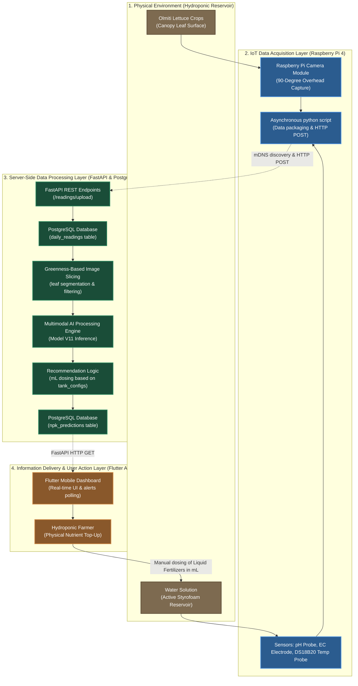

[Prev](./page-46-model-evolution-history.md) | [Next](./page-48-manual-zeroconf-testing.md)

# Guide for Capstone Section 3.2: System Conceptual Framework (English Only)

This guide provides the copy-pasteable text and Mermaid systems diagrams to update **Section 3.2 (Conceptual Framework)** of your Capstone project. It outlines the closed-loop IoT system architecture (Data Acquisition, Wireless Transmission, Server-side Processing, and Client Feedback Loop) as implemented in the codebase.

---

## 1. System Conceptual Diagram (Mermaid Closed-Loop Feedback Model)

You can copy and insert this system-level conceptual framework diagram directly into your thesis. It models the entire system as a closed-loop cyber-physical system, mapping directly to the sensor scripts, database structures, FastAPI services, and Flutter dashboard integrations:

---

## 2. Updated Manuscript Text (English Copy-Pasteable)

Below is the updated text for **Section 3.2 Conceptual Framework** (incorporating the system's actual code boundaries, database configurations, and dosing calculation pipeline):

> ### **3.2 Conceptual Framework**
> 
> The LEAFCLOUD system operates as a closed-loop cyber-physical system (CPS), utilizing an Input-Process-Output (IPO) model with a feedback loop to automate nutrient management in hydroponic lettuce farming. The system structure, shown in **Figure 6**, is divided into four main operational phases:
> 
> * **Input (Data Acquisition & Transmission):** The physical inputs consist of telemetry from the water solution (electrical conductivity, pH, and water temperature) and optical data from the crop canopy (overhead photos of the Olmiti lettuce leaves). The Raspberry Pi gateway acts as the data collector, reading sensor values and capturing images simultaneously at preset upload intervals. These inputs are packaged into JSON payloads and transmitted via wireless local area network (WLAN) to the FastAPI server, where they are persistently saved in the database's `daily_readings` table.
> 
> * **Process (Multi-Task Inference & Recommendation Logic):** Once raw readings are saved, the server initiates preprocessing. The visual data is passed through a greenness-based cropping script to segment the plant leaves from the background, generating up to five high-quality crops. Sensor telemetry is normalized using boundary scaling. These preprocessed inputs are fed into the multimodal AI engine, which outputs both a categorical solution state classification (`Water`, `NPK`, `Micro`, or `Mix`) and continuous nutrient depletion scales (`macro_scale` and `micro_scale`). The outputs are checked by a rule-based anomaly filter. Finally, the recommendation engine combines these predictions with active tank configurations (specifically target volumes, chemical ratios, and fertilizer percentages retrieved from the `tank_configs` table) to calculate the exact volume of liquid fertilizer (in milliliters) required to return the reservoir to its optimal balance.
> 
> * **Output (Dashboard Delivery & Alerts):** The processed data—including raw sensor readings, estimated NPK classes, depletion scales, anomaly flags, and dosing recommendations—is saved in the `npk_predictions` table. These metrics are made available to the client mobile application via secure REST APIs. The Flutter dashboard fetches the endpoint data to display real-time statuses and visual warning flags. Concurrently, a background worker alerts the farmer with push notifications if nutrients drop below target ranges, displaying the precise volume of top-up fertilizers needed.
> 
> * **Feedback Loop (Physical Intervention):** The operational cycle is completed by the farmer's physical actions. Acting on the mobile app's top-up instructions, the farmer manually adds the recommended fertilizer volume (in mL) to the active reservoir. This manual intervention directly alters the physical environment, correcting the nutrient balance. The updated environmental state is then captured by the sensors in the subsequent acquisition cycle, maintaining a continuous, self-correcting feedback loop.

---

## 3. Code-to-System Mapping (How the Code Implements the Framework)

| Conceptual Step | Software Implementation / DB Tables | Code File |
| :--- | :--- | :--- |
| **1. Data Acquisition** | Raw reading values and overhead image path captured on the IoT node. | `raspberry_pi/` scripts |
| **2. Wireless Transmission** | Client posts reading payloads to the server API; server saves raw inputs to DB. | [app/api/endpoints/readings.py](file:///Users/fil/Fil/leafcloud/mimeng_leafcloud_server_v2/app/api/endpoints/readings.py)   Table: `daily_readings` |
| **3. Preprocessing** | Image crop segmentation filtering out non-green background pixels. | [app/services/image_processing.py](file:///Users/fil/Fil/leafcloud/mimeng_leafcloud_server_v2/app/services/image_processing.py) |
| **4. AI Processing** | Model loaded and custom `StopGradient` registered to isolate classification and regression. | [app/services/ai_service.py:L20-43](file:///Users/fil/Fil/leafcloud/mimeng_leafcloud_server_v2/app/services/ai_service.py#L20-L43) |
| **5. Anomaly Filter** | Rule-based logic preventing logical contradictions in predictions. | [app/services/ai_service.py:L145-156](file:///Users/fil/Fil/leafcloud/mimeng_leafcloud_server_v2/app/services/ai_service.py#L145-L156) |
| **6. Dosing Calculation** | Mathematical calculation translating class, scales, and active tank configurations into top-up mL recommendations. | [app/services/ai_service.py:L157-170](file:///Users/fil/Fil/leafcloud/mimeng_leafcloud_server_v2/app/services/ai_service.py#L157-L170)   Table: `tank_configs` |
| **7. User Interface** | FastAPI serves dashboard endpoints to the Flutter mobile application. | [app/api/endpoints/dashboard.py](file:///Users/fil/Fil/leafcloud/mimeng_leafcloud_server_v2/app/api/endpoints/dashboard.py) |
| **8. Background Alerts** | Background services fetch notifications and display them on the mobile client. | [app/api/endpoints/alerts.py](file:///Users/fil/Fil/leafcloud/mimeng_leafcloud_server_v2/app/api/endpoints/alerts.py) |
